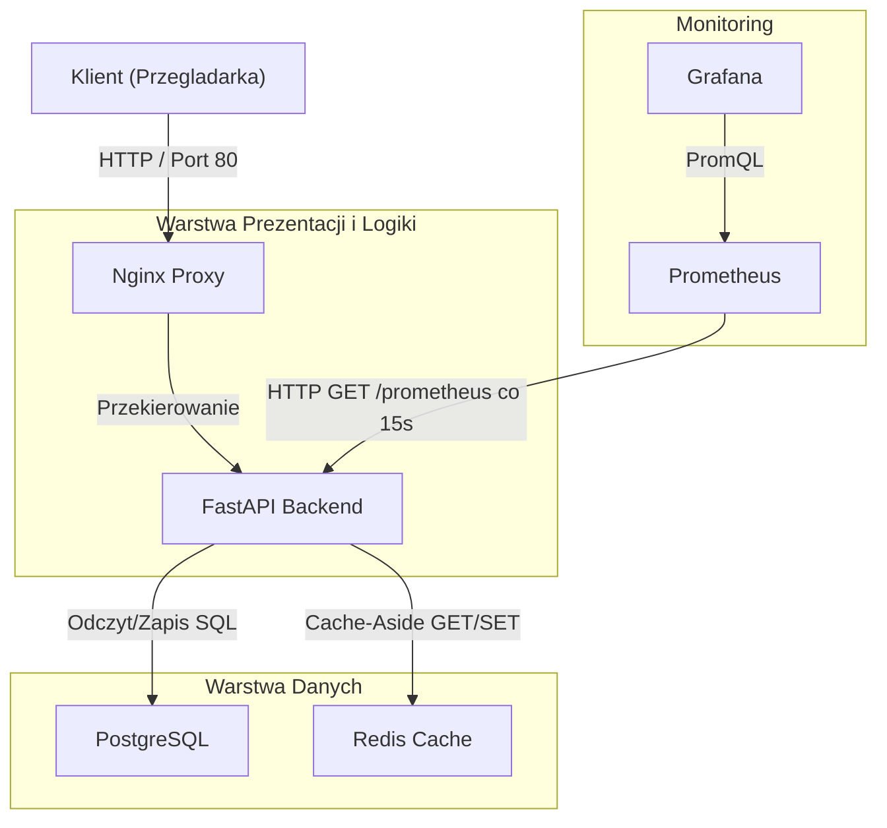

# Dokumentacja Techniczna — System TaskFlow
# Autor: Jakub Francuz | Praca magisterska, 2026

Dokument zawiera opis techniczny architektury, modelu danych, punktów końcowych API (REST), konfiguracji infrastrukturalnej, potoków CI/CD oraz strategii testowania systemu zarządzania zadaniami TaskFlow.

---

## 1. Architektura systemu

Aplikacja TaskFlow została zaprojektowana w architekturze mikroserwisowej z podziałem na warstwy prezentacji, logiki biznesowej oraz przechowywania danych. Wszystkie komponenty działają jako niezależne usługi kontenerowe.

### Komponenty systemu:
1.  **Nginx (Reverse Proxy)**: Odpowiada za przyjmowanie ruchu HTTP na porcie 80, kompresję gzip, logowanie zapytań oraz przekazywanie żądań do serwera aplikacji.
2.  **FastAPI Backend**: Asynchroniczny serwer aplikacji napisany w Pythonie 3.12. Odpowiada za logikę biznesową, walidację danych (Pydantic), generowanie stron HTML (Jinja2) oraz wystawianie interfejsu REST API.
3.  **PostgreSQL 16**: Główna relacyjna baza danych przechowująca informacje o zadaniach.
4.  **Redis 7**: Pamięć podręczna (in-memory) przechowująca zserializowane listy zadań w celu odciążenia bazy danych i przyspieszenia czasu odpowiedzi aplikacji.

---

## 2. Architektura oprogramowania (Backend)

Kod backendu został podzielony zgodnie ze wzorcem Separation of Concerns (Rozdzielenie Odpowiedzialności) na warstwy:
*   **Warstwa routingu (`src/api/routes/`)**: Definiuje punkty końcowe HTTP, obsługuje parametry zapytań i formatuje odpowiedzi.
*   **Warstwa logiki biznesowej (`src/api/services/`)**: Implementuje reguły biznesowe, steruje dostępem do bazy danych oraz zarządza unieważnianiem i zapisem danych w pamięci podręcznej.
*   **Warstwa dostępu do danych (`src/api/database.py`, `src/api/models.py`)**: Odpowiada za sesje asynchroniczne ORM SQLAlchemy 2.0 i mapowanie obiektowo-relacyjne.

### Wzorzec Cache-Aside (Redis)
Zaimplementowany mechanizm cache działa według następujących zasad:
1.  Odczyt listy zadań kierowany jest w pierwszej kolejności do Redis.
2.  W przypadku trafienia (cache hit), dane są deserializowane i zwracane natychmiast.
3.  W przypadku braku (cache miss), dane są pobierane z PostgreSQL, zapisywane w cache z określonym czasem życia (TTL = 300s) i zwracane klientowi.
4.  Każda operacja modyfikująca stan (zapis, edycja, usunięcie zadania) powoduje natychmiastowe usunięcie odpowiednich kluczy z cache (cache invalidation) z użyciem komendy `SCAN` (bezpieczniejsza od `KEYS` przy dużej liczbie rekordów), co gwarantuje spójność danych.
5.  W przypadku niedostępności Redis aplikacja automatycznie przełącza się na bezpośrednie zapytania do PostgreSQL (graceful degradation) — żaden wyjątek nie jest propagowany do klienta.

---

## 3. Model danych bazy (PostgreSQL)

Baza danych przechowuje zadania w tabeli `tasks`. Schemat bazy danych został zaprojektowany z uwzględnieniem asynchronicznego dialektu `asyncpg`.

### Tabela `tasks`
| Kolumna | Typ danych | Ograniczenia | Opis |
|---------|------------|--------------|------|
| `id` | INTEGER | PRIMARY KEY, AUTOINCREMENT, INDEX | Unikalny identyfikator zadania. |
| `title` | VARCHAR(255) | NOT NULL, INDEX | Tytuł zadania. Indeksowany dla szybkiego wyszukiwania. |
| `description` | TEXT | NULLABLE, Default: '' | Szczegółowy opis zadania (maks. 5000 znaków w walidacji Pydantic). |
| `status` | ENUM | NOT NULL, Default: 'todo', INDEX | Status: `todo`, `in_progress`, `done`, `archived`. Indeksowany dla filtrowania. |
| `priority` | ENUM | NOT NULL, Default: 'medium' | Priorytet: `low`, `medium`, `high`, `critical`. |
| `created_at` | TIMESTAMP WITH TIMEZONE | NOT NULL, Default: UTC NOW | Data i czas utworzenia rekordu (automatyczny). |
| `updated_at` | TIMESTAMP WITH TIMEZONE | NOT NULL, Default: UTC NOW, onupdate: UTC NOW | Data i czas ostatniej modyfikacji (automatyczna aktualizacja przez ORM). |
| `is_deleted` | BOOLEAN | NOT NULL, Default: FALSE | Flaga dla mechanizmu bezpiecznego usuwania (soft-delete). Rekord nie jest fizycznie kasowany. |

---

## 4. Specyfikacja API (REST)

Punkt wejścia dla API: `/api/v1/tasks`

| Metoda | Endpoint | Opis | Format wejścia (JSON) | Kod sukcesu | Kody błędów |
|--------|----------|------|-----------------------|-------------|-------------|
| **POST** | `/` | Tworzy nowe zadanie | `{title, description?, priority?, status?}` | `201 Created` | `422` (Błędna walidacja) |
| **GET** | `/` | Pobiera listę zadań (filtry, sortowanie, paginacja) | *Query params*: `page`, `per_page`, `status`, `priority`, `sort_by`, `sort_order` | `200 OK` | `422` (Błędne parametry) |
| **GET** | `/{id}` | Pobiera szczegóły pojedynczego zadania | *Brak* | `200 OK` | `404` (Brak zadania) |
| **PATCH** | `/{id}` | Częściowo aktualizuje dane zadania | `{title?, description?, priority?, status?}` | `200 OK` | `404` (Brak zadania), `422` |
| **DELETE**| `/{id}` | Usuwa zadanie (soft-delete) | *Brak* | `200 OK` | `404` (Brak zadania) |

---

## 5. Infrastruktura i Konteneryzacja

### Obrazy Docker:
*   **API**: Dwuetapowy proces budowania (multi-stage build) oparty na obrazie `python:3.12-slim`. Pierwsza faza instaluje zależności do katalogu `/install`, druga faza kopiuje prekompilowane pakiety do lekkiego obrazu bazowego, tworzy użytkownika systemowego bez uprawnień roota (`appuser`) i definiuje sondę kontrolną `HEALTHCHECK`.
*   **Nginx**: Lekki obraz oparty na `nginx:alpine` z podmienioną konfiguracją proxy.

### Orkiestracja Kubernetes:
*   **Namespace (`taskflow`)**: Logiczna separacja zasobów klastra.
*   **StatefulSets**: Wykorzystane do uruchomienia PostgreSQL (`postgres`) oraz Redis (`redis`) w celu zagwarantowania stałych nazw sieciowych (poprzez powiązane usługi *headless*) oraz stałego połączenia z przypisanymi wolumenami danych (`PersistentVolumeClaims`).
*   **Deployments**: Wykorzystane do skalowania bezstanowej warstwy API oraz serwera Nginx.
*   **Autoskalowanie (HPA)**: Skonfigurowane dla usługi API, automatycznie zwiększające liczbę replik podów w zakresie od 2 do 5 na podstawie średniego zużycia procesora (próg 70% CPU).
*   **Ingress**: Zarządza ruchem zewnętrznym w oparciu o domenę `taskflow.local`.

---

## 6. Potoki CI/CD (GitHub Actions)

Wdrożono cztery niezależne potoki automatyzacji w ramach GitHub Actions.

### Proces CI (`ci.yml`) — Continuous Integration:
1.  Uruchomienie przy każdym zdarzeniu `push` oraz `pull_request` do gałęzi `main`.
2.  Konfiguracja środowiska Python 3.12 z cache'owaniem zależności pip.
3.  Weryfikacja jakości kodu: `black --check` (formatowanie, limit 120 znaków) oraz `flake8` (linting PEP8).
4.  Uruchomienie testów przez `pytest` z raportem pokrycia kodu (`--cov`, `--cov-report=term-missing`).
5.  Weryfikacja budowania obrazów Docker dla API i Nginx (`push: false` — tylko kompilacja, bez publikowania).

### Proces CD (`cd.yml`) — Continuous Deployment:
1.  Uruchamiany wyłącznie po scaleniu zmian z gałęzią `main` (nie przy PR).
2.  Zalogowanie do GitHub Container Registry (GHCR) przez automatyczny `GITHUB_TOKEN`.
3.  Budowanie produkcyjnych obrazów Docker dla API i Nginx.
4.  Oznaczenie obrazów dwoma tagami: `:latest` (zawsze aktualny) oraz `:${{ github.sha }}` (unikalny hash commita umożliwiający precyzyjny rollback).
5.  Wypchnięcie gotowych obrazów do GHCR.

### Proces DevSecOps (`security.yml`) — Bezpieczeństwo:
1.  **Trivy** (`scan-type: fs`, `severity: CRITICAL,HIGH`, `ignore-unfixed: true`): skanuje pliki repozytorium pod kątem znanych podatności CVE. Ignoruje błędy bez dostępnej poprawki.
2.  **Bandit** (`-r src/api/ -ll -ii`): statyczna analiza kodu Python — wykrywa hardcoded secrets, niebezpieczne funkcje (`eval`, `pickle`), wzorce SQL injection. Flagi `-ll -ii` oznaczają: tylko HIGH severity i HIGH confidence.

### Walidacja manifestów Kubernetes (`k8s-validate.yml`):
1.  Uruchamiany przy zmianach plików w katalogu `k8s/`.
2.  **Kubeconform**: waliduje składnię i semantykę manifestów YAML względem oficjalnego schematu Kubernetes API. Wykrywa błędy w nazwach pól, typach danych i wymaganych wartościach zanim manifest zostanie zastosowany na klastrze (podejście Shift-Left).

---

## 7. Strategia testowania

Testy automatyczne są podzielone na trzy pliki według poziomu i zakresu:

### Konfiguracja testów (`tests/conftest.py`)
- Testowa baza danych: **SQLite in-memory** (`sqlite+aiosqlite:///./test_taskflow.db`) zamiast PostgreSQL — nie wymaga uruchomionego serwera, testy są szybkie i izolowane.
- Mechanizm izolacji: `app.dependency_overrides[get_db]` — FastAPI DI podmienia sesję PostgreSQL na sesję SQLite dla każdego testu.
- Fixture `setup_database` z `autouse=True`: tworzy tabele przed każdym testem (`create_all`) i usuwa je po teście (`drop_all`) — pełna izolacja.
- Redis: wyłączony w testach — `cache_service` zwraca `None` przy braku połączenia, aplikacja działa bez cache (graceful degradation testowane implicite).
- Klient HTTP: `httpx.AsyncClient` z `ASGITransport` — testuje prawdziwe endpointy HTTP bez uruchamiania serwera sieciowego.

### Testy CRUD (`tests/test_tasks.py`) — 11 przypadków testowych
| Test | Co sprawdza |
|------|-------------|
| `test_create_task` | POST z pełnymi danymi, weryfikacja HTTP 201 i pól odpowiedzi |
| `test_create_task_minimal` | POST z samym tytułem, domyślna wartość priority='medium' |
| `test_create_task_empty_title` | POST z `title=''`, oczekiwane HTTP 422 (walidacja Pydantic) |
| `test_get_tasks_empty` | GET na pustej bazie, `tasks=[]`, `total=0` |
| `test_get_tasks_with_data` | Tworzenie 3 zadań, weryfikacja `total=3` |
| `test_get_task_by_id` | GET `/{id}` — poprawny tytuł w odpowiedzi |
| `test_get_task_not_found` | GET `/99999` — oczekiwane HTTP 404 |
| `test_update_task` | PATCH z nowym tytułem i statusem |
| `test_delete_task` | DELETE + weryfikacja HTTP 404 po usunięciu (soft-delete) |
| `test_filter_by_status` | GET `?status=todo` — tylko zadania todo w wynikach |
| `test_pagination` | GET `?page=1&per_page=2` — `len=2`, `total=5`, `pages=3` |

### Testy funkcjonalne End-to-End (`tests/test_functional.py`) — 3 scenariusze
| Scenariusz | Opis |
|------------|------|
| `test_full_task_lifecycle` | Pełny cykl: CREATE → GET → PATCH (status+priority) → DELETE → GET 404 |
| `test_filtering_and_pagination_combination` | Jednoczesne filtrowanie i paginacja na zbiorze danych mieszanych statusów |
| `test_validation_and_error_handling` | Brak tytułu (422), nieistniejące ID (404), niepoprawny status (422) |

### Testy monitoringu (`tests/test_health.py`)
Sprawdzają poprawność odpowiedzi endpointów `/health/live`, `/health/ready` i `/metrics`.

---

## 8. Diagramy architektoniczne

Katalog `diagrams/` zawiera diagramy w formacie PlantUML (`.puml`):

| Plik | Typ | Opis |
|------|-----|------|
| `c4_container_diagram.puml` | C4 Level 2 (Kontenery) | Wszystkie komponenty systemu, protokoły i relacje między nimi |
| `deployment_diagram.puml` | UML Deployment | Pody K8s, Services, PVC, HPA, integracja CI/CD z GHCR |
| `sequence_create_task.puml` | UML Sequence | Przepływ tworzenia zadania: walidacja → INSERT → inwalidacja cache |
| `sequence_get_tasks_cache.puml` | UML Sequence | Wzorzec Cache-Aside: Cache HIT vs Cache MISS z TTL |
